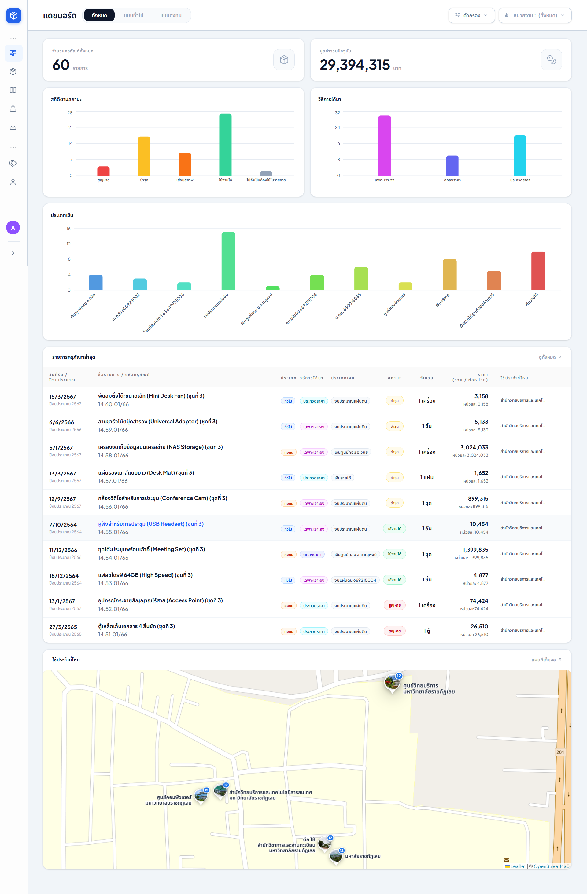
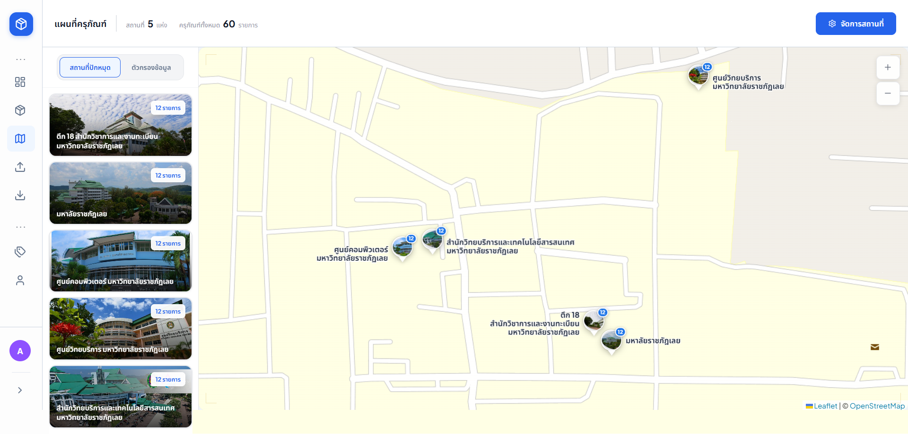
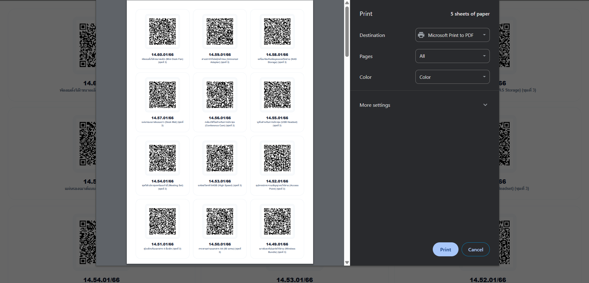

# 🛡️ Asset Management System

> ระบบบริหารและติดตามครุภัณฑ์สำหรับองค์กร — นำเข้าข้อมูลจาก Excel จำนวนมาก ระบุตำแหน่งบนแผนที่แบบ Interactive สร้าง QR Code ประจำรายการ และควบคุมสิทธิ์การเข้าถึงหลายระดับ (RBAC) ในระบบเดียวกัน

-------------------------------------------------------------------

🔗 **[Live Demo](https://asset-management-system-bice.vercel.app)**

-------------------------------------------------------------------

### 🔐 Demo Credentials

| Role | Email | Password |
|---|---|---|
| **Administrator** | `admin@gmail.com` | `123456789` |
| **General User** | `user@gmail.com` | `123456789` |

> [!NOTE]
> บัญชี Admin สามารถจัดการหมวดหมู่และผู้ใช้งานได้ ส่วนบัญชี User สามารถจัดการข้อมูลครุภัณฑ์และนำเข้า Excel ได้ตามปกติ

---

## 🖼️ Screenshots & Demos

### 📊 Dashboard & Overview
ภาพรวมสถิติคลังครุภัณฑ์ทั้งหมด พร้อมกราฟแยกตามประเภทและสถานะแบบ Real-time

### 🗺️ Interactive Map
ระบุตำแหน่งครุภัณฑ์บนแผนที่ แยกตามอาคาร/สถานที่ พร้อมแสดงรายการครุภัณฑ์ในหมุดนั้นๆ

<video src="docs/screenshots/map-video.mp4" width="100%" muted autoplay loop playsinline></video>

### 📥 Smart Excel Import
กระบวนการนำเข้าข้อมูลจาก Excel ที่ชาญฉลาด แมปคอลัมน์อัตโนมัติ และตรวจสอบความถูกต้องก่อนบันทึก
<video src="docs/screenshots/import-video.mp4" width="100%" muted autoplay loop playsinline></video>

### 📍 Bulk Operations (Map & Images)
จัดการตำแหน่งแผนที่และรูปภาพสำหรับหลายรายการพร้อมกันในคลิกเดียว

**Bulk Map Pinning**
<video src="docs/screenshots/map-pin-video.mp4" width="100%" muted autoplay loop playsinline></video>

**Bulk Image Management**
<video src="docs/screenshots/upload-image-video.mp4" width="100%" muted autoplay loop playsinline></video>

### 🏷️ QR Code System
สร้างและพิมพ์ QR Code สำหรับติดบนตัวครุภัณฑ์ เพื่อการตรวจสอบที่รวดเร็ว

---

---

## ✨ Key Features

| Feature | รายละเอียด |
|---|---|
| **📥 นำเข้าข้อมูล Excel** | อ่านไฟล์ Excel แล้วแมปคอลัมน์อัตโนมัติ ตรวจสอบข้อมูลก่อนบันทึกจริง พร้อมบันทึกประวัติการนำเข้าทุกครั้ง |
| **📤 ส่งออกรายงาน Excel** | กรองข้อมูลตามปีงบประมาณ ประเภท หรือหน่วยงาน แล้วดาวน์โหลดเป็นไฟล์ Excel พร้อม Styling และเลือกรูปแบบวันที่ได้ |
| **🗺️ แผนที่ระบุตำแหน่ง** | ปักหมุดครุภัณฑ์บนแผนที่ Interactive แต่ละหมุดมีชื่ออาคาร รูปภาพ และรายการครุภัณฑ์ในพื้นที่นั้น |
| **🔍 ค้นหาและกรองข้อมูล** | กรองได้หลายเงื่อนไขพร้อมกัน ผลลัพธ์แสดงทันทีโดยไม่ต้องโหลดหน้าใหม่ |
| **☑️ เลือกหลายรายการพร้อมกัน** | เลือกหลายรายการแล้วลบ สร้าง QR Code หรือดูรูปภาพรวมได้ในคลิกเดียว |
| **🖼️ จัดการรูปภาพกลุ่ม** | เปิดดูและจัดการรูปภาพของหลายรายการพร้อมกัน (Bulk Image Modal) |
| **📍 ระบุพิกัดกลุ่ม** | ระบุตำแหน่งแผนที่ให้หลายรายการในคราวเดียว (Bulk Map Modal) |
| **🔒 ระบบสิทธิ์ผู้ใช้ (RBAC)** | แยก Admin / User ชัดเจน พร้อมระบบลืมรหัสผ่านผ่าน Email |
| **🏷️ สร้าง QR Code** | สร้าง QR Code รายเดียวหรือหลายรายการ ดาวน์โหลดหรือพิมพ์ได้ทันที |
| **🗂️ จัดการหมวดหมู่** | เพิ่ม แก้ไข ลบหมวดหมู่และประเภทหมวดหมู่ได้แบบยืดหยุ่น |
| **👥 จัดการผู้ใช้งาน** | Admin เพิ่มผู้ใช้ ตั้งสิทธิ์ และระงับบัญชีได้จากหน้าเดียว |
| **🖼️ แกลเลอรีรูปภาพ** | อัปโหลด ดู และลบรูปภาพของแต่ละครุภัณฑ์ พร้อม Modal Viewer เต็มจอ |
| **🧹 ล้างรูปภาพอัตโนมัติ** | ลบรูปภาพที่ไม่มีรายการครุภัณฑ์อ้างอิงแล้วออกโดยอัตโนมัติ |

---

## 🛠️ Tech Stack & Rationale

| Technology | Version | เหตุผลที่เลือก |
|---|---|---|
| **Next.js** (App Router) | 16.1.6 | SSR/ISR ทำให้ load ครั้งแรกเร็ว รองรับ Route Handler สำหรับ API |
| **React** | 19.2.3 | Server Components + Actions ลด client bundle ได้มาก |
| **TypeScript** | 5.9.3 | ป้องกัน runtime error ในโค้ดระดับ enterprise ที่มีหลาย type |
| **Prisma ORM** | 7.4.0 | Type-safe query + migration tracking ขยายตัวได้ง่ายในอนาคต |
| **PostgreSQL** | 16 | Relational DB รองรับข้อมูลซับซ้อน query หนัก และ relation หลายระดับ |
| **Tailwind CSS** | 4.1.18 | Utility-first CSS เวอร์ชันใหม่ เร็วกว่าเดิมและ config น้อยลงมาก |
| **Better-Auth** | 1.4.x | Session management + password hashing + RBAC มาตรฐานสากล |
| **Framer Motion** | 12.x | Animation library — ใช้ทำ staggered reveal และ micro-interactions ให้ UI รู้สึก responsive |
| **Leaflet.js** | 1.9.x | Lightweight map library ไม่มี API cost ต่างจาก Google Maps |
| **Supabase** | Cloud | PostgreSQL DB (Serverless) + S3 Compatible Storage สำหรับเก็บรูปภาพ |
| **Vercel** | Edge | Deployment Platform — รองรับ Edge Functions และ ISR สำหรับความเร็วสูงสุด |

---

## 👤 User Roles & Permissions

| สิทธิ์ | Admin | User |
|---|:---:|:---:|
| ดูรายการครุภัณฑ์ | ✅ | ✅ |
| เพิ่ม / แก้ไขครุภัณฑ์ | ✅ | ✅ |
| ลบครุภัณฑ์ (รายเดียว / Bulk) | ✅ | ✅ |
| นำเข้า Excel | ✅ | ✅ |
| ส่งออก Excel | ✅ | ✅ |
| จัดการแผนที่และ Map Pins | ✅ | ✅ |
| สร้าง QR Code | ✅ | ✅ |
| จัดการหมวดหมู่ (Categories) | ✅ | ❌ |
| จัดการผู้ใช้ (Users) | ✅ | ❌ |
| ระงับ / ยกเลิกระงับบัญชี | ✅ | ❌ |

---

## 👨‍💻 About the Developer

**คุณสุรสิทธิ์ พิมพ์สีดา (Surasit Phimseeda)**

- 📧 [surasit.phimseeda111@gmail.com](mailto:surasit.phimseeda111@gmail.com)
- 🐙 [github.com/Surasit111](https://github.com/Surasit111)

---

## 📄 License

This project is proprietary software. All rights reserved.

---

*Developed with ❤️ for excellence in Asset Management.*